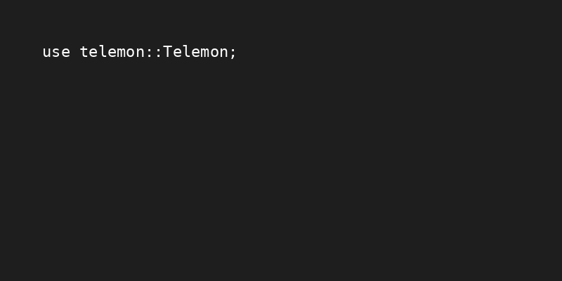

# 📦 Telemon

**Telemon** is a lightweight Rust library for sending logs or messages to a Telegram group using a bot. It supports topic-based messaging and flexible configuration through a `telemon.toml` file.

## 🚀 Features

- Send messages to Telegram topics
- Configuration via `telemon.toml`
- Optional logging to console
- Flexible usage with or without global `chat_id`

## 🛠 Configuration

Create a `telemon.toml` file in your project root:

```toml
token = "BOT_TOKEN"          # Your Telegram bot token
chat_id = -100xxxxxxx     # (Optional) Telegram group chat ID
show_logs = false            # Set to true to display logs in console
parse_mode = "HTML"      # (Optional) Message format: Markdown, HTML, or empty for plain text
group_id = -100xxxxxx    # (Optional) Use this if you only want to send messages to a group, not to a specific topic
```

- `token`: The bot token provided by BotFather
- `chat_id`: (Optional) The group chat ID where messages will be sent
- `show_logs`: If true, logs will also be printed to the terminal
- `parse_mode`: Defines the message format sent to Telegram. Accepted values are: `Markdown`, `MarkdownV2`, `Html`
- `group_id` (Optional) Used to send messages directly to a Telegram group without specifying a topic (i.e., for non-forum groups).

Markdown – Enables Markdown formatting

HTML – Enables HTML formatting

Leave empty or omit for plain text

## 📤 Usage

You can send messages in two ways, depending on whether `chat_id` is defined in the config.

### 1. If `chat_id` is set in the config

Use `.to(topic_id)` — the `chat_id` will be automatically read from the config:

```rust
use telemon::Telemon;

Telemon::send("✅ Success").to(34);
```
### 2. If `chat_id` is **not** set in the config

You must provide the `chat_id` as the first value in a tuple:

```rust
use telemon::Telemon;

Telemon::send("🚨 Error occurred").to((-1002483629475, 34));
```
### 3. If `group_id` is set (and chat_id is not used), you can send messages using the .to_group() method, which does not require a thread ID.
```rust
Telemon::send("Hello group!").to_group();
```
In this case:
- The first value is the `chat_id`
- The second value is the topic ID within the group

## 📌 Notes

- If `show_logs = true`, every message sent will also be printed to the terminal.
- If `show_logs = false`, logs will be silent.
- `topic_id` refers to the forum topic ID inside the Telegram group.


### ✅ Correct Usage in Async Code
To safely call a blocking function such as `Telemon::send` inside an async function, wrap it with `tokio::task::spawn_blocking`. This runs the operation on a separate thread, ensuring that your async runtime remains non-blocked:
```rust
use telemon::Telemon;

let reply = "Hello from async!";

tokio::task::spawn_blocking(move || {
    Telemon::send(&reply).to(2)
}).await?;
```


## 📄 License

MIT License
